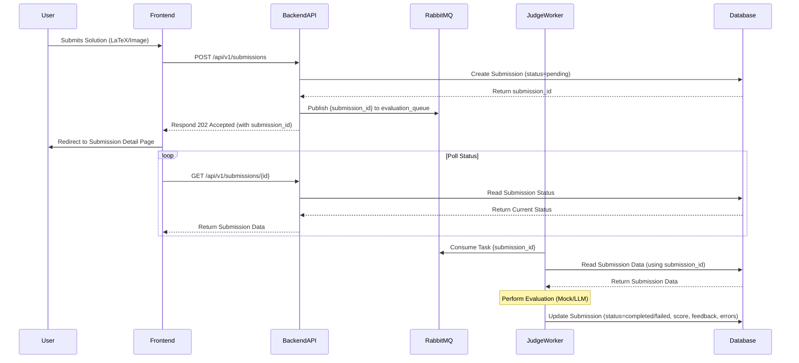
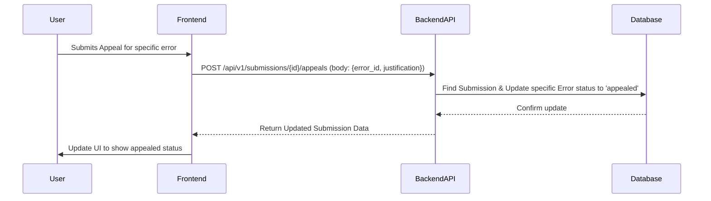

# System Architecture

Technical architecture of the MOOJ system.

## Core Components (Target Architecture)

```mermaid
flowchart LR
    subgraph User Browser
        Frontend(React App)
    end

    subgraph Docker Network
        FrontendContainer[Frontend Container]
        BackendContainer[Backend API Container]
        WorkerContainer[Judge Worker Container]
        MQ[Message Queue (RabbitMQ)]
        DB[(Database (PostgreSQL))]
    end

    Frontend -- HTTP Requests --> BackendContainer
    BackendContainer -- Publishes Task --> MQ
    BackendContainer -- Reads/Writes --> DB
    WorkerContainer -- Consumes Task --> MQ
    WorkerContainer -- Reads/Writes --> DB
    
    UserBrowser -- Accesses --> FrontendContainer
```

### Components Summary

*   **Frontend**: React (MUI, Redux Toolkit/RTK Query) for UI, interacts with Backend API.
*   **Backend API**: FastAPI (Python, SQLAlchemy, Pydantic) handles requests, manages submission metadata, publishes tasks to MQ.
*   **Message Broker**: RabbitMQ decouples API from Worker, handles `evaluation_queue`.
*   **Judge Worker**: Python service consumes tasks from MQ, performs evaluation, updates DB.
*   **Database**: PostgreSQL stores problems, submissions, results, user data.

## Data Flow & Evaluation Pipeline

Describes the asynchronous submission and evaluation workflow.

### Submission Flow



**Steps:**

1.  **User Submits**: Via Frontend.
2.  **API Request**: Frontend `POST /api/v1/submissions`.
3.  **DB Create**: Backend creates `Submission` (status: pending).
4.  **Publish Task**: Backend sends `submission_id` to RabbitMQ `evaluation_queue`.
5.  **API Response**: Backend returns `202 Accepted` with `submission_id`.
6.  **Polling**: Frontend polls `GET /api/v1/submissions/{id}` for status.
7.  **Worker Consume**: Judge Worker gets `submission_id` from RabbitMQ.
8.  **Worker Fetch**: Worker gets full submission details from DB.
9.  **Evaluation**: Worker executes evaluation logic (currently mock).
10. **DB Update**: Worker updates `Submission` with results (status, score, feedback, errors).
11. **Result Display**: Frontend polling retrieves and displays results.

### Appeal Flow



**Steps:**

1.  **User Appeals**: Via Frontend for a specific error.
2.  **API Request**: Frontend `POST /api/v1/submissions/{id}/appeals` with `error_id` and justification.
3.  **DB Update**: Backend finds submission and updates the specific error's status to `appealed`.
4.  **API Response**: Backend returns updated submission data.
5.  **UI Update**: Frontend shows the appealed status.

## Evaluation Details (Current Placeholder)

*   Currently a mock evaluation in the Backend (planned for Judge Worker).
*   Simulates delay, sets status to `completed`, generates mock score/feedback/errors. 