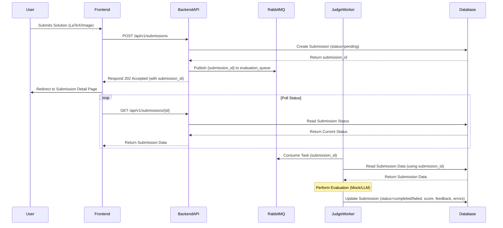
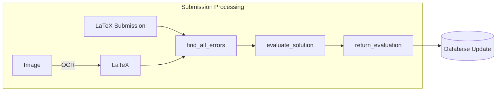
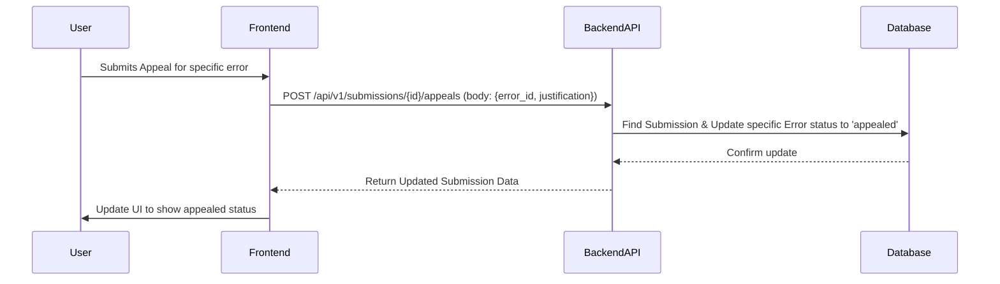

# System Architecture

Technical architecture of the MOOJ system.

## Core Components (Target Architecture)

> **Note**: This is the target architecture. The current MVP implementation merges the Backend API and Judge Worker functionality.

```mermaid
flowchart LR
    subgraph User Browser
        Frontend(React App)
    end

    subgraph Docker Network
        FrontendContainer[Frontend Container]
        BackendContainer[Backend API Container]
        WorkerContainer[Judge Worker Container]
        MQ[Message Queue (RabbitMQ)]
        DB[(Database (PostgreSQL))]
    end

    Frontend -- HTTP Requests --> BackendContainer
    BackendContainer -- Publishes Task --> MQ
    BackendContainer -- Reads/Writes --> DB
    WorkerContainer -- Consumes Task --> MQ
    WorkerContainer -- Reads/Writes --> DB
    
    UserBrowser -- Accesses --> FrontendContainer
```

### Components Summary

*   **Frontend**: React (MUI, Redux Toolkit/RTK Query) for UI, interacts with Backend API.
*   **Backend API**: FastAPI (Python, SQLAlchemy, Pydantic) handles requests, manages submission metadata, publishes tasks to MQ.
*   **Message Broker**: RabbitMQ decouples API from Worker, handles `evaluation_queue`.
*   **Judge Worker**: Python service consumes tasks from MQ, performs evaluation, updates DB.
*   **Database**: PostgreSQL stores problems, submissions, results, user data.

#### Backend Directory Structure

The backend follows a standard FastAPI application structure:

```
backend/
├── app/                      # Main application code
│   ├── api/                  # API router and endpoints
│   │   └── v1/               # API version 1
│   │       ├── endpoints/    # Resource-specific endpoints
│   │       └── api.py        # Main API router
│   ├── core/                 # Core functionality
│   │   └── config.py         # Application configuration
│   ├── crud/                 # CRUD database operations
│   ├── db/                   # Database setup and models
│   │   ├── models/           # SQLAlchemy models
│   │   ├── session.py        # Database session
│   │   └── base.py           # Base model class
│   ├── evaluation/           # Evaluation pipeline
│   ├── schemas/              # Pydantic schemas
│   └── main.py               # Entry point
├── tests/                    # Test suite
│   ├── api/                  # API tests
│   ├── core/                 # Core functionality tests
│   ├── crud/                 # CRUD operation tests
│   ├── db/                   # Database tests
│   ├── evaluation/           # Evaluation pipeline tests
│   ├── utils/                # Test utilities
│   └── conftest.py           # Test fixtures
├── .env                      # Environment variables
├── .env.example              # Example environment file
├── requirements.txt          # Python dependencies
├── pytest.ini                # Pytest configuration
├── Dockerfile                # Docker configuration
└── healthcheck.py            # Container health check
```

#### Backend Technology Stack

- FastAPI
- SQLAlchemy (ORM)
- Pydantic
- PostgreSQL
- JWT Authentication
- OpenCV and Tesseract for image processing
- Pytest for testing

## Data Flow & Evaluation Pipeline

The evaluation pipeline is the core of MOOJ's functionality, handling the asynchronous submission and evaluation workflow.

### Submission Flow



**Steps:**

1.  **User Submits**: Via Frontend.
2.  **API Request**: Frontend `POST /api/v1/submissions`.
3.  **DB Create**: Backend creates `Submission` (status: pending).
4.  **Publish Task**: Backend sends `submission_id` to RabbitMQ `evaluation_queue`.
5.  **API Response**: Backend returns `202 Accepted` with `submission_id`.
6.  **Polling**: Frontend polls `GET /api/v1/submissions/{id}` for status.
7.  **Worker Consume**: Judge Worker gets `submission_id` from RabbitMQ.
8.  **Worker Fetch**: Worker gets full submission details from DB.
9.  **Evaluation**: Worker executes evaluation logic (currently mock).
10. **DB Update**: Worker updates `Submission` with results (status, score, feedback, errors).
11. **Result Display**: Frontend polling retrieves and displays results.

### Detailed Evaluation Process

The evaluation pipeline consists of these primary components:



1. **Image Processing** (if needed): For image submissions, OCR converts to LaTeX
2. **Error Detection**: Analyzes the submission for logical and mathematical errors
3. **Evaluation**: Assigns score and generates feedback based on errors found
4. **Results**: Returns structured evaluation data to update the submission

### Appeal Flow



**Steps:**

1.  **User Appeals**: Via Frontend for a specific error.
2.  **API Request**: Frontend `POST /api/v1/submissions/{id}/appeals` with `error_id` and justification.
3.  **DB Update**: Backend finds submission and updates the specific error's status to `appealed`.
4.  **API Response**: Backend returns updated submission data.
5.  **UI Update**: Frontend shows the appealed status.

## Current Implementation vs. Target Architecture

> **Current Status**: The Judge Worker is still being decoupled. Currently, the Backend API handles evaluation synchronously.

| Component | Current Implementation | Target Architecture |
|-----------|------------------------|---------------------|
| Backend API | Handles requests, manages data, AND performs evaluation | Handles requests, manages data, publishes tasks |
| Judge Worker | Not implemented | Separate service consuming tasks from queue |
| Message Queue | Not implemented | RabbitMQ for decoupled processing |
| Evaluation | Synchronous, mock implementation | Asynchronous, separated into worker |

## Frequently Asked Questions

**Q: How does the submission evaluation work currently?**  
A: Currently, the backend API performs a mock evaluation synchronously when a submission is received. It simulates delay, sets the status to `completed`, and generates mock score/feedback/errors.

**Q: What will change when the Judge Worker is implemented?**  
A: The evaluation will become asynchronous. The Backend API will publish a task to RabbitMQ and respond immediately with a 202 Accepted status. The Judge Worker will consume the task and perform the evaluation independently.

**Q: How does the system process image submissions?**  
A: Images are processed through OCR (using OpenCV and Tesseract) to convert them to LaTeX before evaluation. This is handled by the `image_to_LaTeX` component in the evaluation pipeline.

**Q: What database models are involved in the evaluation process?**  
A: The primary models are `Problem`, `Submission`, `Evaluation`, and `Error`. These are defined in the `db/models/` directory.

**Q: How is feedback generated?**  
A: Currently, feedback is mock-generated based on predefined patterns. In the target architecture, it will be generated by the Judge Worker based on the specific errors detected in the submission.

**See also:**
- [Development Guide > Evaluation Pipeline](./development.md#evaluation-pipeline) for implementation details
- [Development Guide > Testing > Evaluation Pipeline](./development.md#testing-the-evaluation-pipeline) for testing the evaluation process 