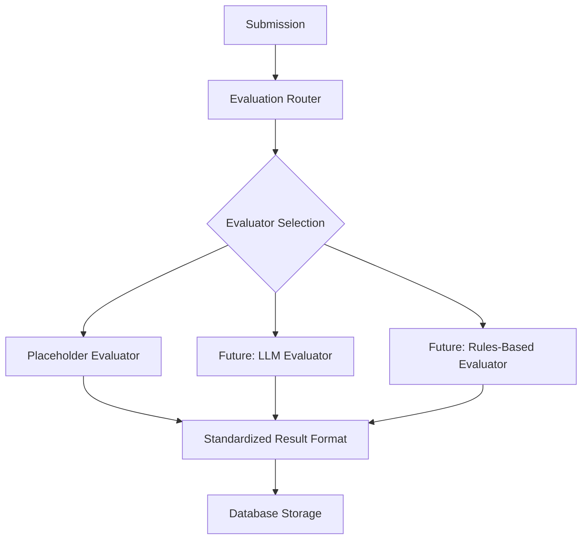
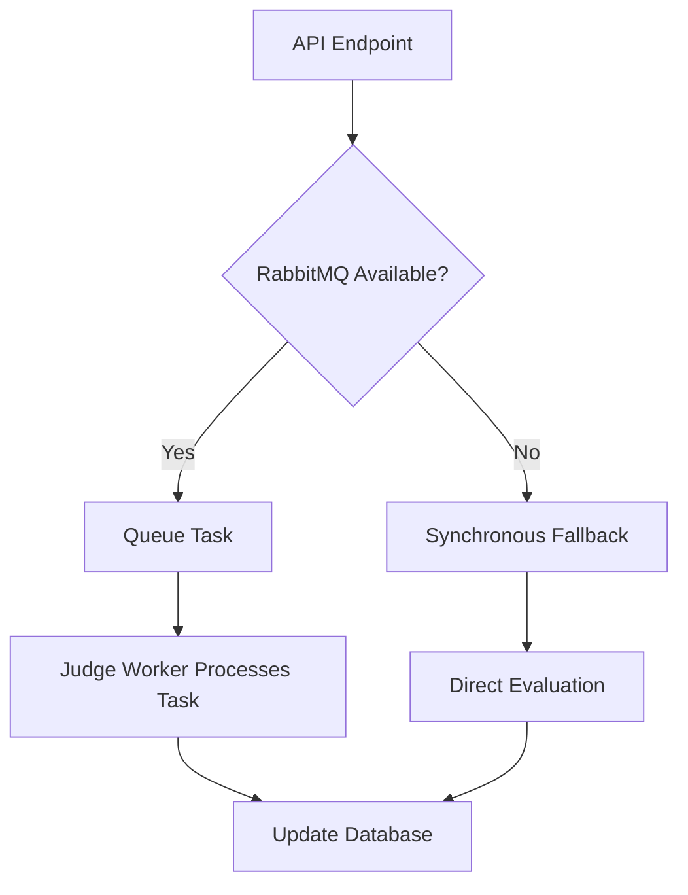

# System Architecture

Technical architecture of the MOOJ system.

## Core Components (Target Architecture)

> **Note**: This is the target architecture. The current MVP implementation merges the Backend API and Judge Worker functionality.

```mermaid
flowchart LR
    subgraph User Browser
        Frontend(React App)
    end

    subgraph Docker Network
        FrontendContainer[Frontend Container]
        BackendContainer[Backend API Container]
        WorkerContainer[Judge Worker Container]
        MQ[Message Queue (RabbitMQ)]
        DB[(Database (PostgreSQL))]
    end

    Frontend -- HTTP Requests --> BackendContainer
    BackendContainer -- Publishes Task --> MQ
    BackendContainer -- Reads/Writes --> DB
    WorkerContainer -- Consumes Task --> MQ
    WorkerContainer -- Reads/Writes --> DB
    
    UserBrowser -- Accesses --> FrontendContainer
```

### Components Summary

*   **Frontend**: React (MUI, Redux Toolkit/RTK Query) for UI, interacts with Backend API.
*   **Backend API**: FastAPI (Python, SQLAlchemy, Pydantic) handles requests, manages submission metadata, publishes tasks to MQ, handles appeal requests.
*   **Message Broker**: RabbitMQ decouples API from Worker, handles `evaluation_queue`.
*   **Judge Worker**: Python service consumes tasks from MQ, performs initial evaluation (`find_errors`), updates DB.
*   **Database**: PostgreSQL stores problems, submissions, results, user data.

#### Backend Directory Structure

The backend follows a standard FastAPI application structure:

```
backend/
├── app/                      # Main application code
│   ├── api/                  # API router and endpoints
│   │   └── v1/               # API version 1
│   │       ├── endpoints/    # Resource-specific endpoints
│   │       └── api.py        # Main API router
│   ├── core/                 # Core functionality
│   │   └── config.py         # Application configuration
│   ├── crud/                 # CRUD database operations
│   ├── db/                   # Database setup and models
│   │   ├── models/           # SQLAlchemy models
│   │   ├── session.py        # Database session
│   │   └── base.py           # Base model class
│   ├── evaluation/           # Evaluation pipeline
│   ├── schemas/              # Pydantic schemas
│   └── main.py               # Entry point
├── tests/                    # Test suite
│   ├── api/                  # API tests
│   ├── core/                 # Core functionality tests
│   ├── crud/                 # CRUD operation tests
│   ├── db/                   # Database tests
│   ├── evaluation/           # Evaluation pipeline tests
│   ├── utils/                # Test utilities
│   └── conftest.py           # Test fixtures
├── .env                      # Environment variables
├── .env.example              # Example environment file
├── requirements.txt          # Python dependencies
├── pytest.ini                # Pytest configuration
├── Dockerfile                # Docker configuration
└── healthcheck.py            # Container health check
```

#### Backend Technology Stack

- FastAPI
- SQLAlchemy (ORM)
- Pydantic
- PostgreSQL
- JWT Authentication
- OpenCV and Tesseract for image processing
- Pytest for testing

### Data Models

#### Problem Model

The core data entity for mathematical problems:

```python
class Problem(Base):
    __tablename__ = "problems"

    id = Column(Integer, primary_key=True, index=True)
    title = Column(String, index=True, nullable=False)
    statement = Column(Text, nullable=False)
    difficulty = Column(Float, nullable=False)  # 1.0-9.0 scale
    topics = Column(JSON)  # List of topics as JSON
    is_published = Column(Boolean, default=False)
    created_at = Column(DateTime, default=datetime.utcnow)
    
    # Relationships
    submissions = relationship("Submission", back_populates="problem")
```

- **difficulty**: Float value between 1.0 and 9.0, following the defined scale:
  - **1.0 - 1.5: Easy (Green)**
  - **2.0 - 3.5: Intermediate (Blue)**
  - **4.0 - 6.0: Advanced (Yellow)**
  - **6.5 - 8.0: Expert (Red)**
  - **8.5 - 9.0: Master (Deep Red)**
  - See the [Usage Guide](./usage.md#creating-a-new-problem) for detailed descriptions and examples.

#### Error Model

The standardized format for errors detected in submissions:

```python
# Represented as a JSON object within the Submission model
ErrorDetail = {
    "id": str,            # Unique identifier for the error
    "description": str,   # Detailed explanation of the error
    "severity": bool,     # false = trivial, true = non_trivial
    "status": str,        # "active", "appealing", "resolved", "rejected", "overturned"
}
```

- **Status Lifecycle**: See [Judging Flow > Error Status Lifecycle](./judging_flow.md#error-status-lifecycle) for detailed explanations.
    - `active`, `appealing`, `resolved`, `rejected`, `overturned` (future)

#### Submission Model

```python
class Submission(Base):
    __tablename__ = "submissions"

    id = Column(Integer, primary_key=True, index=True)
    problem_id = Column(Integer, ForeignKey("problems.id"), nullable=False, index=True)
    solution_text = Column(Text, nullable=False)
    submitted_at = Column(DateTime, default=datetime.utcnow, nullable=False)
    status = Column(String, nullable=False, index=True)  # "pending", "processing", "appealing", "completed", "evaluation_error"
    appeal_attempts = Column(Integer, default=0, nullable=False) # Tracks number of appeal batches submitted (max 5)
    
    # Evaluation results
    score = Column(Integer, nullable=True)  # Score (potentially updated after appeal)
    errors = Column(JSON, nullable=True)  # List of ErrorDetail objects
    
    # Relationship back to the problem
    problem = relationship("Problem", back_populates="submissions")
```

- **Status Lifecycle**: See [Judging Flow > Submission Status Lifecycle](./judging_flow.md#submission-status-lifecycle) for detailed explanations.
    - `pending`, `processing`, `appealing`, `completed`, `evaluation_error`

## Judging Flow & Evaluation Pipeline

The evaluation pipeline is the core of MOOJ's functionality, handling the asynchronous submission and evaluation workflow, including appeals.

**See Also:**
- **[Judging Flow](./judging_flow.md)**: Detailed description of submission processing, status lifecycles, and the appeal/re-evaluation process.
- [Development Guide > Evaluation Pipeline](./development.md#evaluation-pipeline): Information on the evaluator interface and implementation details.

### Evaluator Architecture

MOOJ uses a modular evaluator system based on the `BaseEvaluator` interface, managed by the `EvaluatorRouter`. This allows for different evaluation strategies.



## Fault Tolerance & Error Handling

The system is designed to be fault-tolerant, particularly in the asynchronous evaluation pipeline:



1. **RabbitMQ Connection Handling**:
   - Multiple connection attempts with exponential backoff
   - Detailed connection error logging
   - Synchronous processing fallback when messaging system is unavailable

2. **Worker Resiliency**:
   - Automatic reconnection to RabbitMQ if connection is lost
   - Health check endpoint for monitoring worker status
   - Graceful shutdown handling through signal handlers

3. **Database Transaction Safety**:
   - All database operations wrapped in try/except blocks
   - Proper transaction rollback on errors
   - Session management to prevent connection leaks

These mechanisms ensure that even if components of the system experience temporary failures, the overall system continues to function and recover automatically when possible.

## Current Implementation vs. Target Architecture

> **Current Status**: The Judge Worker is still being decoupled. Currently, the Backend API handles evaluation synchronously.

| Component | Current Implementation | Target Architecture |
|-----------|------------------------|---------------------|
| Backend API | Handles requests, manages data, AND performs evaluation | Handles requests, manages data, publishes tasks |
| Judge Worker | Not implemented | Separate service consuming tasks from queue |
| Message Queue | Not implemented | RabbitMQ for decoupled processing |
| Evaluation | Synchronous, mock implementation | Asynchronous, separated into worker |

## Frequently Asked Questions

**Q: How does the submission evaluation work currently?**  
A: Currently, the backend API performs a mock evaluation synchronously when a submission is received. It simulates delay, sets the status to `completed`, and generates mock score/feedback/errors.

**Q: What will change when the Judge Worker is implemented?**  
A: The evaluation will become asynchronous. The Backend API will publish a task to RabbitMQ and respond immediately with a 202 Accepted status. The Judge Worker will consume the task and perform the evaluation independently.

**Q: How does the system process image submissions?**  
A: Images are processed through OCR (using OpenCV and Tesseract) to convert them to LaTeX before evaluation. This is handled by the `image_to_LaTeX` component in the evaluation pipeline.

**Q: What database models are involved in the evaluation process?**  
A: The primary models are `Problem`, `Submission`, `Evaluation`, and `Error`. These are defined in the `db/models/` directory.

**Q: How is feedback generated?**  
A: Currently, feedback is mock-generated based on predefined patterns. In the target architecture, it will be generated by the Judge Worker based on the specific errors detected in the submission.

**See also:**
- [Development Guide > Evaluation Pipeline](./development.md#evaluation-pipeline) for implementation details
- [Development Guide > Testing > Evaluation Pipeline](./development.md#testing-the-evaluation-pipeline) for testing the evaluation process 