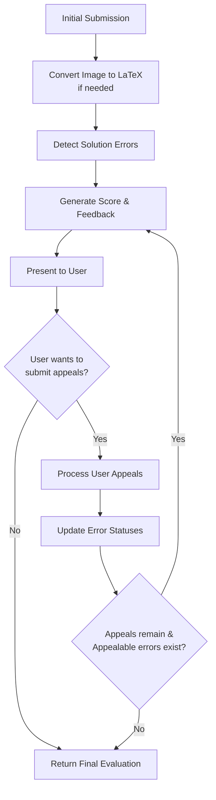

# MOOJ Evaluation Pipeline

## Table of Contents

1. [Overview](#1-overview)
2. [Components](#2-components)
3. [Unified Flow](#3-unified-flow)
4. [Object Schemas](#4-object-schemas)
5. [Implementation Guidelines](#5-implementation-guidelines)
6. [Testing Strategy](#6-testing-strategy)

## 1. Overview

The evaluation pipeline analyzes mathematical proofs, identifies errors, and processes appeals. The system uses a single unified function with an iterative approach for handling both initial evaluation and appeals.

## 2. Components

- **`image_to_LaTeX`**: Converts images to LaTeX (JPG/PNG → LaTeX text, OCR-based, 30s timeout)
- **`find_all_errors`**: Detects logical, mathematical, and syntactical errors (LaTeX + problem → error array)
- **`process_evaluation`**: Unified function handling initial evaluation and appeals in a loop

## 3. Unified Flow

### 3.1 Evaluation Loop

The evaluation process follows a loop-based approach:



This approach handles the entire evaluation lifecycle in a single function call with an internal loop that continues until completion.

### 3.2 Unified Function

```python
def process_evaluation(problem_statement, submission, max_appeals=3):
    """
    Process evaluation and appeals in a unified loop.
    
    Args:
        problem_statement: The problem statement
        submission: Initial submission (image or LaTeX)
        max_appeals: Maximum allowed appeals
        
    Returns:
        Final evaluation after all appeals are processed
    """
    # Convert image to LaTeX if needed
    latex_solution = submission.content
    if submission.type == "image":
        latex_solution = image_to_LaTeX(submission.content)
    
    # Track appeal count
    appeal_count = 0
    
    # Track errors and appeals
    errors = find_all_errors(problem_statement, latex_solution)
    all_appeals = []
    
    # Evaluation loop
    while True:
        # Generate current evaluation
        score = calculate_score(errors, all_appeals)
        feedback = generate_feedback(problem_statement, latex_solution, 
                                     errors, all_appeals)
        
        # Create current evaluation result
        evaluation = {
            "submission_id": submission.id,
            "latex_representation": latex_solution,
            "score": score,
            "feedback": feedback,
            "errors": errors,
            "appealable_errors": [e.id for e in errors if is_appealable(e)],
            "appeals_processed": appeal_count,
            "appeals_accepted": count_accepted_appeals(errors),
            "appeals_remaining": max_appeals - appeal_count
        }
        
        # Return final result if max appeals reached or no appealable errors
        if appeal_count >= max_appeals or not evaluation["appealable_errors"]:
            return evaluation
        
        # Present to user and get appeals (external interaction)
        user_appeals = present_and_get_appeals(evaluation)
        
        # Exit if user chooses not to appeal
        if not user_appeals:
            return evaluation
            
        # Process appeals
        appeal_count += len(user_appeals)
        all_appeals.extend(user_appeals)
        
        # Update error statuses based on appeals
        errors = process_appeal_justifications(
            problem_statement,
            latex_solution,
            errors,
            user_appeals
        )
```

## 4. Object Schemas

### 4.1 Error Object

```json
{
  "id": "error-123",
  "type": "logical|mathematical|syntactical",
  "location": "Line 3, step 2",
  "description": "Invalid application of chain rule",
  "severity": "high|medium|low",
  "appealed": false,
  "appeal_accepted": null
}
```

### 4.2 Appeal Object

```json
{
  "error_id": "error-123",
  "justification": "My application is correct because...",
  "submission_timestamp": "2023-11-14T12:00:00Z"
}
```

### 4.3 Evaluation Result

```json
{
  "submission_id": 456,
  "latex_representation": "\\int_{a}^{b} f(x) \\, dx",
  "score": 75,
  "feedback": "# Evaluation\n...",
  "errors": [/* Error objects */],
  "appealable_errors": ["error-1", "error-2"],
  "appeals_processed": 1,
  "appeals_accepted": 0,
  "appeals_remaining": 2
}
```

## 5. Implementation Guidelines

### 5.1 Error Handling

- **Timeouts**: Image processing (30s), LLM calls (15s)
- **Retries**: Max 3 retries with exponential backoff
- **Graceful Degradation**: Fallback models, caching
- **Comprehensive Logging**: Context-rich error tracking

### 5.2 Parallelization

- Concurrent image processing
- Parallel proof analysis
- Worker queue for load distribution

### 5.3 LLM Integration

- Versioned prompts with examples
- Template-based approach
- Model cascading (small → large)
- Output validation

## 6. Testing Strategy

- Unit tests for each component
- Integration tests for the complete flow
- Mock tests for LLM interactions
- Edge cases: poor images, unusual notation
- Load and performance testing 